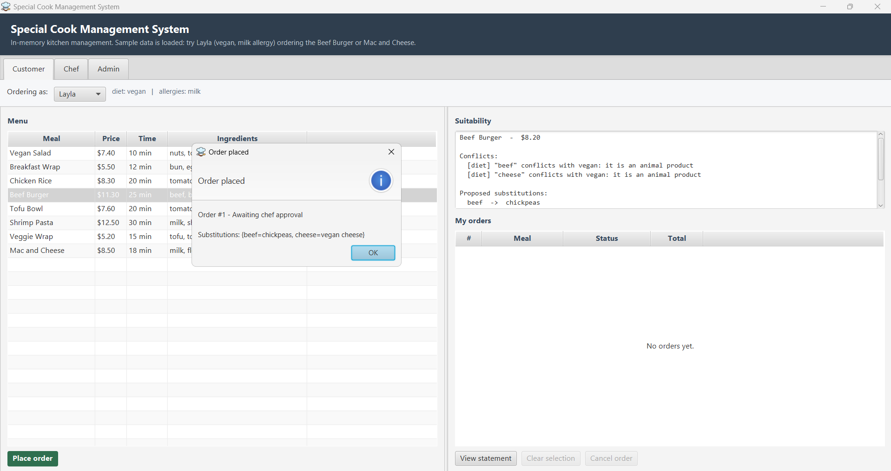
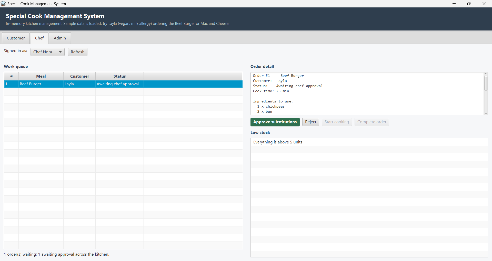
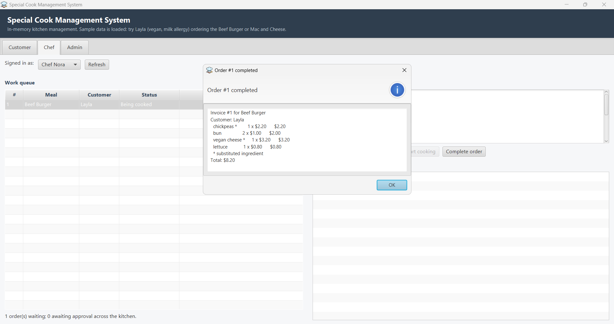
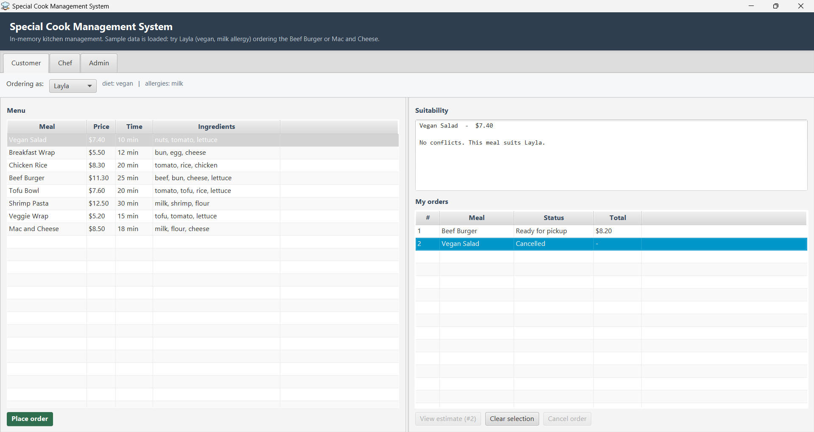
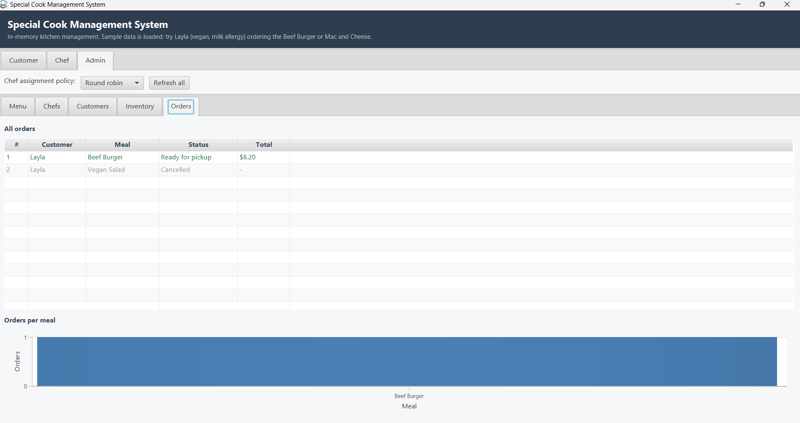
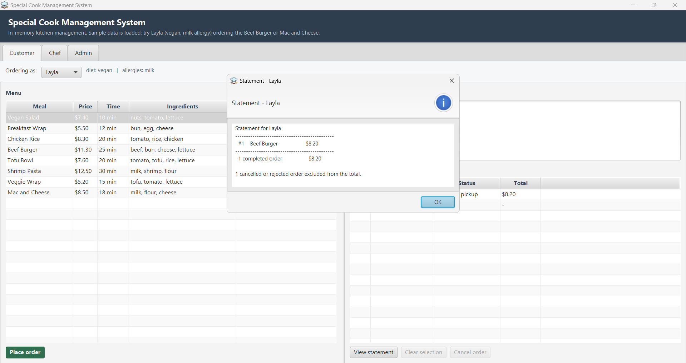

# Special Cook Management System

An in-memory kitchen management system: customers with dietary profiles order meals, the system
detects allergy and dietary conflicts and proposes ingredient substitutions, chefs review and cook
them, and completed orders produce itemised invoices.

Built as a software-engineering coursework project, so the code is written to be *read*: SOLID
principles, TDD/BDD, and clean separation of layers. **There is no database** — everything lives in
memory and resets when the application stops.

> ### About this repository
>
> This is the **enhanced version** of an earlier iteration of the same coursework project
> (March–May 2025). The domain model and the Gherkin feature files carry over from it; the
> structure, the test suite and both user interfaces are rewritten.
>
> A number of bugs found in that iteration are fixed here, and each has a test covering it so it
> cannot come back. Comments through the source occasionally refer to "the previous version" or
> "the old code" — that is the earlier iteration.

```
Java 17+  ·  Maven (wrapper included)  ·  JUnit 5  ·  Cucumber 7  ·  JavaFX 21
234 tests  ·  48 BDD scenarios  ·  88% line coverage
```

---

## Quick start

You do not need Maven installed — the wrapper fetches it.

```bash
./mvnw clean verify        # compile, run all 234 tests, produce the coverage report
./mvnw javafx:run          # launch the JavaFX desktop interface
./mvnw exec:java           # launch the console interface
```

On Windows use `mvnw.cmd` in place of `./mvnw`.

Both interfaces start with sample data loaded. Useful logins:

| Who | Email | Profile |
|---|---|---|
| Layla | `layla@example.com` | vegan, allergic to milk |
| Ahmad | `ahmad@example.com` | halal, allergic to shrimp |
| Salma | `salma@example.com` | gluten-free + vegetarian, allergic to nuts |
| Chef Nora | `nora@kitchen.com` | chef |
| Chef Zaid | `zaid@kitchen.com` | chef |

**Try this first:** open the Customer tab as *Layla* and select **Beef Burger**. The suitability
panel explains that beef and cheese are not vegan, proposes replacements that are actually in stock
and actually vegan, and the order then goes to a chef for approval.

**Then try this:** select that order in *My orders* and press **Cancel order**. Without touching a
refresh button anywhere, the Chef tab drops it from the queue, the Admin orders table greys it out
and strikes it through, and the Admin inventory table shows its ingredients back in stock — the
three tabs are kept in step by [`ViewRefresher`](src/main/java/com/cookmgmt/ui/fx/ViewRefresher.java).

---

## Screenshots

<table>
<tr>
<td width="33%" align="center" valign="top">
<a href="docs/screenshots/customer-conflicts.png"></a><br>
<b>Conflicts and substitution</b><br>
<sub>Every clash listed with its own reason, and replacements that are both in stock and actually vegan.</sub>
</td>
<td width="33%" align="center" valign="top">
<a href="docs/screenshots/chef-approval.png"></a><br>
<b>Chef approval</b><br>
<sub>Substitutions need sign-off. <i>Start cooking</i> is greyed because that transition is illegal from this state.</sub>
</td>
<td width="33%" align="center" valign="top">
<a href="docs/screenshots/invoice.png"></a><br>
<b>Itemised invoice</b><br>
<sub>Line items that sum exactly to the total; <code>*</code> marks a substituted ingredient.</sub>
</td>
</tr>
<tr>
<td width="33%" align="center" valign="top">
<a href="docs/screenshots/order-cancelled.png"></a><br>
<b>Cancelled order</b><br>
<sub>No total, and the bill button is disabled — nothing was cooked, so nothing is charged.</sub>
</td>
<td width="33%" align="center" valign="top">
<a href="docs/screenshots/admin-orders.png"></a><br>
<b>Admin report</b><br>
<sub>Cancelled struck through, completed green. The chart counts only orders the kitchen will serve.</sub>
</td>
<td width="33%" align="center" valign="top">
<a href="docs/screenshots/statement.png"></a><br>
<b>Statement</b><br>
<sub>Completed orders totalled; cancelled ones reported as excluded rather than quietly dropped.</sub>
</td>
</tr>
</table>

More screens — inventory, chefs, customers, menu, and the cancellation before/after — in
[docs/SCREENSHOTS.md](docs/SCREENSHOTS.md).

---

## What it does

- **Dietary profiles** — customers record preferences (vegan, vegetarian, halal, kosher,
  gluten-free, dairy-free) and allergies.
- **Conflict detection** — every meal is checked against every rule that applies to the customer,
  and each clash is reported individually with a reason.
- **Substitution** — replacements are drawn from ingredients that fill the same culinary role, are
  acceptable for that customer's diet, and are in stock.
- **Stock control** — placing an order reserves its ingredients atomically; rejecting or cancelling
  returns them; low stock raises a notification.
- **Kitchen workflow** — orders are assigned to chefs by a swappable policy, reviewed when they
  carry substitutions, cooked, and completed through an enforced state machine.
- **Cancellation** — a customer can withdraw an order at any point up to the moment a chef starts
  cooking it, and its ingredients go straight back into stock. Once cooking has begun the action is
  refused: those ingredients have been used, and returning them would invent food that no longer
  exists. Both interfaces read the permitted window from the same state machine, so neither can
  offer an action the domain would reject.
- **Billing** — itemised invoices in `BigDecimal`, with the total frozen at completion, plus a
  per-customer statement. Only completed orders are billed; cancelled and rejected ones are reported
  as excluded rather than silently dropped.

---

## Architecture

```
┌──────────────────────┐        ┌──────────────────────┐
│  ui.console          │        │  ui.fx  (JavaFX)     │   ← no business rules
│  ConsoleApp, menus   │        │  Customer/Chef/Admin │
└──────────┬───────────┘        └───────────┬──────────┘
           └───────────────┬────────────────┘
                           ▼
                  ┌─────────────────┐
                  │  app.AppContext │   composition root — wires everything
                  └────────┬────────┘
                           ▼
   ┌──────────────────────────────────────────────────────┐
   │  service                                             │
   │  OrderService · KitchenService · PricingService      │
   │  InventoryService · SubstitutionService              │
   │  CatalogService · CustomerService · StaffService     │
   └───────┬──────────────────────────────┬───────────────┘
           ▼                              ▼
   ┌───────────────┐            ┌──────────────────────────┐
   │  repository   │            │  domain                  │
   │  (interfaces) │            │ Meal · Order · Customer  │
   │  in-memory    │            │ Money · rule.* · policy.*│
   └───────────────┘            └──────────────────────────┘
```

Dependencies point inward. The domain knows nothing about storage or the user interface, and the
two front ends share one service layer — which is why a rule change takes effect in both without
being written twice.

Full detail in [docs/ARCHITECTURE.md](docs/ARCHITECTURE.md).

---

## SOLID, with the file to look at

| Principle | Where | What it replaced |
|---|---|---|
| **S**ingle responsibility | [`ConsoleApp`](src/main/java/com/cookmgmt/ui/console/ConsoleApp.java) vs [`OrderService`](src/main/java/com/cookmgmt/service/OrderService.java) vs [`Order`](src/main/java/com/cookmgmt/domain/Order.java) | one 870-line `Main` holding UI, dietary rules and sample data |
| **O**pen/closed | [`DietaryRule`](src/main/java/com/cookmgmt/domain/rule/DietaryRule.java) + 6 implementations | an `else if` chain — adding kosher meant editing the UI class |
| **L**iskov substitution | [`ChefAssignmentStrategy`](src/main/java/com/cookmgmt/domain/policy/ChefAssignmentStrategy.java) | index arithmetic inlined in a god object |
| **I**nterface segregation | [`ReadableInventory`](src/main/java/com/cookmgmt/inventory/ReadableInventory.java) / [`MutableInventory`](src/main/java/com/cookmgmt/inventory/MutableInventory.java) | one class handed to everyone, including a `Chef` that never used it |
| **D**ependency inversion | [`Repository`](src/main/java/com/cookmgmt/repository/Repository.java), [`Notifier`](src/main/java/com/cookmgmt/notify/Notifier.java), [`ConsoleIO`](src/main/java/com/cookmgmt/ui/console/ConsoleIO.java) | `new ArrayList<>()` and `new Scanner(System.in)` inside domain classes |

Patterns used: **Repository**, **Strategy** (dietary rules, chef assignment), **Builder** (`Meal`),
**Value Object** (`Money`), **Observer** (`Notifier`).

Worked examples with before/after code in [docs/SOLID.md](docs/SOLID.md).

---

## Testing

```bash
./mvnw test                                  # all tests
./mvnw test -Dtest=DietaryRuleEngineTest     # one unit test class
./mvnw test -Dtest=RunCucumberTest           # the BDD suite only
./mvnw verify                                # + coverage report and 80% gate
```

Reports land in `target/site/jacoco/index.html` (coverage) and `target/cucumber/report.html` (BDD).

| | Count |
|---|---|
| Cucumber scenarios | 48 (192 steps) |
| Unit tests | 186 |
| **Total** | **234** |
| Line coverage | 88% (build fails below 80%; excludes `ui.**`, verified by hand) |

More in [docs/TESTING.md](docs/TESTING.md).

---

## Project layout

```
src/main/java/com/cookmgmt/
├── app/           AppContext (composition root), SampleData
├── domain/        Meal, Order, Customer, Chef, Money, Invoice, Conflict
│   ├── rule/      DietaryRule + Vegan/Vegetarian/Halal/Kosher/GlutenFree/DairyFree/Allergy
│   ├── policy/    ChefAssignmentStrategy + RoundRobin/LeastLoaded
│   └── exception/ InsufficientStock, DuplicateEmail, OrderState
├── inventory/     ReadableInventory, MutableInventory, InMemoryInventory
├── repository/    Repository, InMemoryRepository, Meal/Customer/Chef/Order repositories
├── service/       the eight application services
├── notify/        Notifier, ConsoleNotifier, InMemoryNotifier
├── support/       Text (normalisation, CSV parsing)
└── ui/
    ├── console/   ConsoleApp, ConsoleIO, Customer/Chef/Admin menus
    └── fx/        FxApplication, AppLauncher, Customer/Chef/Admin views

src/test/
├── java/com/cookmgmt/bdd/     RunCucumberTest, TestContext, 9 step-definition classes
├── java/com/cookmgmt/...      unit tests mirroring the main packages
└── resources/features/        9 Gherkin feature files
```

---

## Notes for the reader

- **Everything is in memory by design.** Restarting loses all data. `AppContext` is the only place
  storage is chosen, so a persistent implementation would slot in behind the same interfaces.
- **The two interfaces are deliberately duplicate-free.** If you find a business rule inside
  `ui.console` or `ui.fx`, that is a bug — it belongs in `service` or `domain`.
- **Money is `BigDecimal`, never `double`.** See `MoneyTest.doesNotAccumulateFloatingPointError`.
- **Ingredient names are normalised everywhere** through `Text.normalize`. A casing mismatch between
  a lookup table and its lookups is what silently disabled every beef and shrimp dietary rule in the
  original code.

## Documentation

| Document | Contents |
|---|---|
| [docs/ARCHITECTURE.md](docs/ARCHITECTURE.md) | layers, dependency rules, patterns, key flows |
| [docs/SOLID.md](docs/SOLID.md) | each principle with the before/after code |
| [docs/TESTING.md](docs/TESTING.md) | how to run tests, feature→step map, TDD workflow |
| [docs/SCREENSHOTS.md](docs/SCREENSHOTS.md) | every screen of the interface, with what to look at |
| [CHANGELOG.md](CHANGELOG.md) | what changed in this overhaul |
