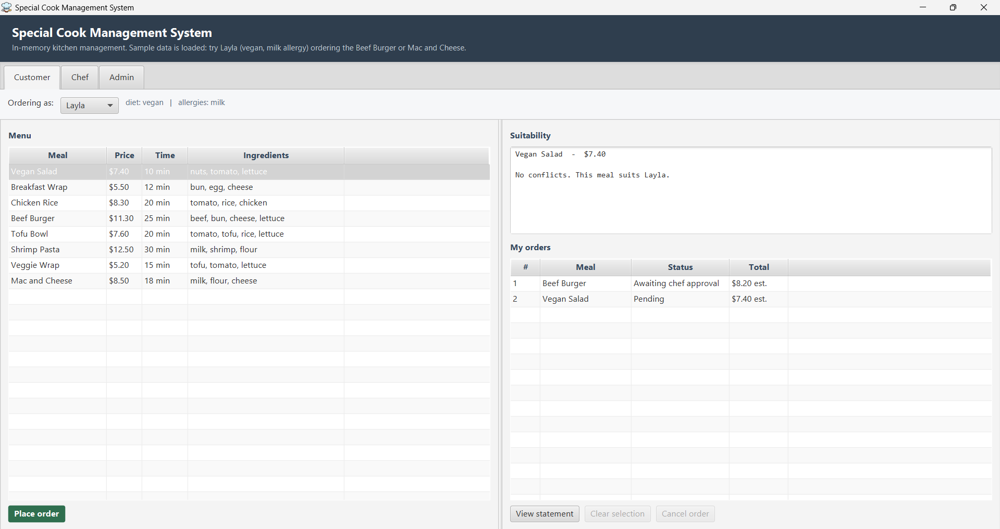
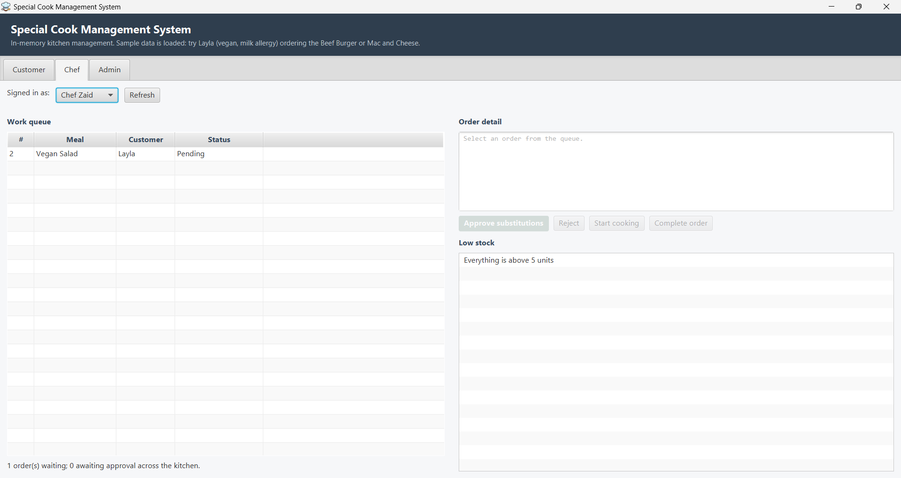
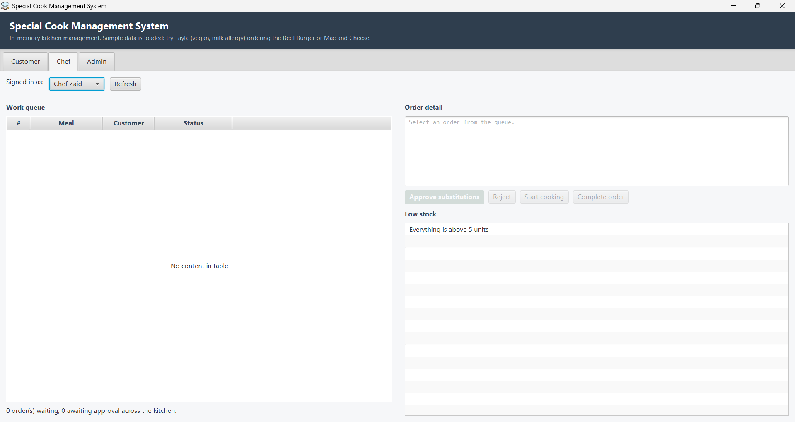
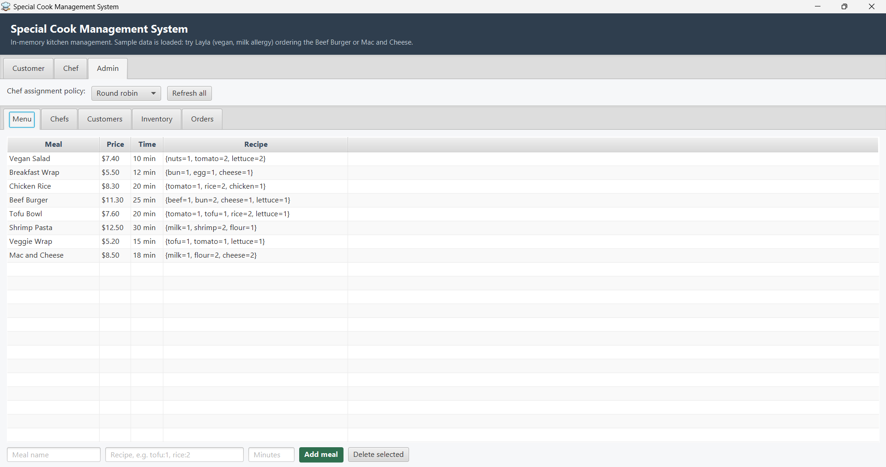
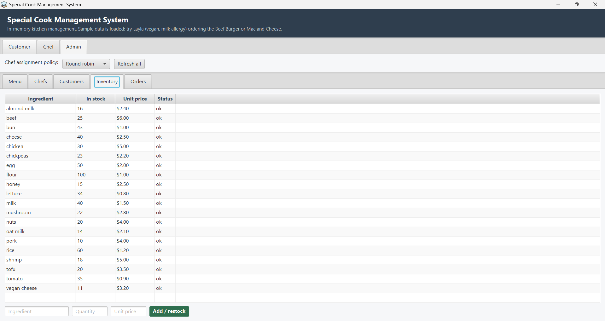
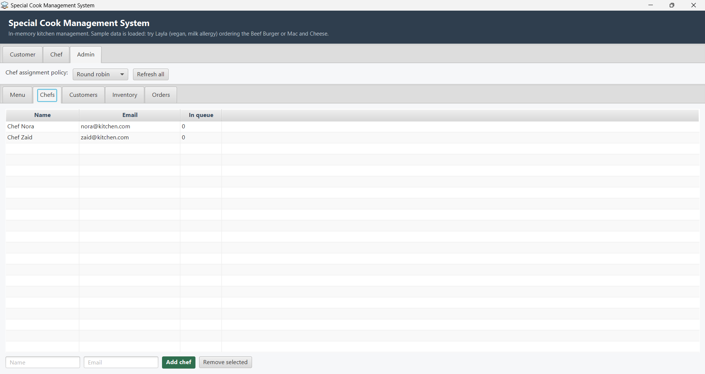
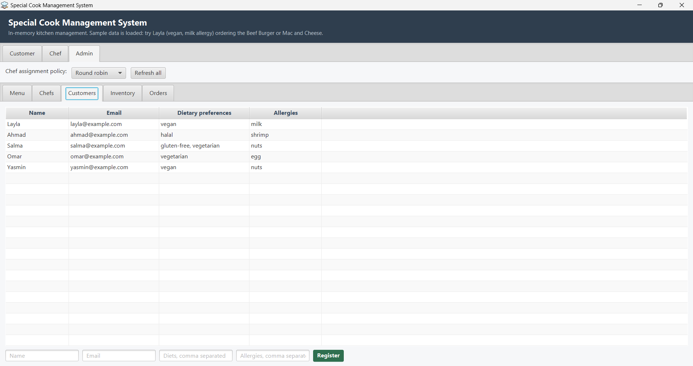

# Screenshots

Every screen of the JavaFX interface, captured from a single session against the sample data that
loads on startup. Six of these also appear in the [README](../README.md); this page is the complete
set.

Run it yourself with `./mvnw javafx:run`.

---

## Customer

### Conflicts and substitution

Layla is vegan with a milk allergy. Selecting the Beef Burger reports each clash separately with its
own reason, rather than the single boolean the original code returned, and proposes replacements
drawn from ingredients that are in stock, fill the same culinary role, and suit her diet.

### Live order list

Two orders in different states. The one carrying substitutions is *Awaiting chef approval*; the one
with no conflicts went straight to *Pending*. Both show a running estimate, so a placed order never
displays `$0.00` while it waits.

### Statement

Completed orders totalled at the price frozen when each was served. Cancelled and rejected orders
are reported as an excluded count rather than silently omitted — the customer can see the decision
was deliberate.

---

## Chef

### Approval queue

An order whose substitutions need sign-off. **Start cooking** and **Complete order** are greyed:
`NEEDS_APPROVAL` cannot transition to `IN_PROGRESS`, and the buttons ask
[`OrderStatus.canTransitionTo`](../src/main/java/com/cookmgmt/domain/OrderStatus.java) rather than
restating the rule — so the interface cannot offer an action the domain would refuse.

### Round-robin assignment

The second chef's queue. Orders are distributed by a
[`ChefAssignmentStrategy`](../src/main/java/com/cookmgmt/domain/policy/ChefAssignmentStrategy.java)
that the Admin tab can swap at runtime.

### Invoice on completion

Line items that sum exactly to the total, with `*` marking each substituted ingredient. The total is
frozen on the order at this moment, so a later price change cannot rewrite a bill already issued.

---

## Cancellation

The two screens below are the same moment seen from two tabs, and together they are the evidence for
the fix described in [CHANGELOG 2.1.0](../CHANGELOG.md): cancelling on the Customer tab reaches the
Chef tab with no refresh button pressed anywhere.

**Customer tab — after cancelling order #2.** The status reads *Cancelled* and the total column
shows `-` rather than an estimate. The bill button is disabled for this row: the order was never
cooked, so there is nothing to charge for. Before the fix it rendered a complete, entirely
fictional invoice.

**Chef tab — the same instant.** The queue that held the order is empty and the counter reads
`0 order(s) waiting`. Nothing was clicked on this tab; it was rebuilt by
[`ViewRefresher`](../src/main/java/com/cookmgmt/ui/fx/ViewRefresher.java).

---

## Admin

### Orders report

Completed orders in green, cancelled struck through and greyed. The orders-per-meal chart counts
only orders the kitchen will actually serve — including withdrawn ones would inflate demand for
precisely the meals customers turned out not to want.

### Menu

Meals with their recipes parsed from the `tofu:1, rice:2` field below the table. Prices are derived
from current ingredient costs rather than stored, so restocking at a new price updates the menu.

### Inventory

Stock and unit price per ingredient, with a status column that flags anything running low. Placing
an order reserves its ingredients here; cancelling or rejecting returns them.

### Chefs

Registered chefs with a live count of the orders assigned to each. The count is derived from the
order repository rather than stored on the chef, so it cannot drift out of step with reality.

### Customers

Dietary preferences and allergies per customer — the data every conflict check runs against.
Registration rejects a duplicate email address.

